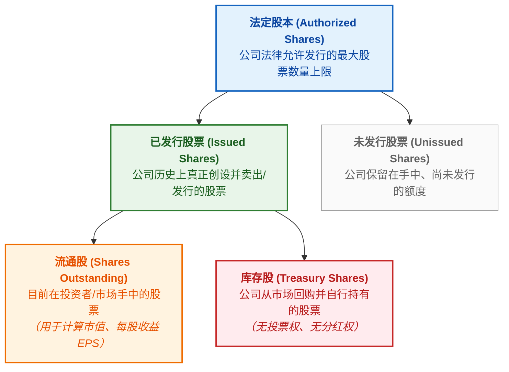
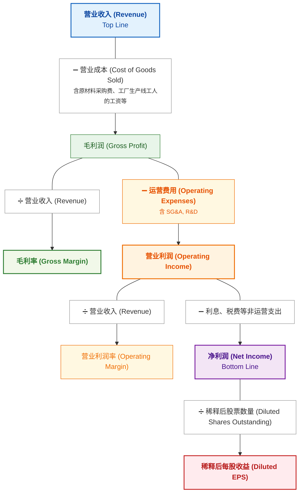

# Stock Trading Notes

## 1. 基础概念

### 持仓（Holdings / Position）
- **持仓：** 是指投资者**买入并持有**的资产（股票、基金、黄金、债券等）。
- **建仓（Open a Position）：** 第一次买入某只股票/基金（开始建立持仓）。
- **加仓 / 减仓（Add/Reduce to a Position）：** 增加买入 / 卖出手中一部分持仓。
- **平仓（Close a Position）：** 把持有的资产卖出或反向对冲，针对的是某一笔具体的交易。常见情形：看涨做多（Long）、看跌做空（Short）。
- **爆仓 / 强制平仓（Forced Liquidation / Margin Call）：** 当投资者加杠杆（借钱）炒股或做期货，亏损过大导致保证金不够时，交易平台或券商为了防止投资者欠钱不还，会不经你同意，强制把投资者的持仓卖掉。
- **清仓（Liquidate / Sell off）：** 把手里的某只股票/基金全部卖掉（持仓归零）。
- **重仓（Heavy Position）：** 把大部分资金都买在了某一只股票或某一个行业上。

加杠杆&期货

#### 加杠杆（Leverage）
加杠杆是指利用借入资金或衍生工具来放大投资规模的手段。
- **放大收益与风险：** 如果资产价格朝预期方向变动，盈利会按杠杆倍数成倍增加；反之，若价格向相反方向变动，亏损也会同等放大。
- **主要应用形式：**
    - 融资融券：向证券公司借钱买股（融资）或借股卖出（融券）。
    - 保证金交易：在期货、外汇等交易中，只需缴纳一定比例的保证金即可参与全额交易。

#### 期货 (Futures)
期货是一种标准化金融合约，约定在未来某个特定时间，以预先确定的价格买入或卖出特定数量的标的资产。
- **“期”与“现”相对：** 现货是“一手交钱，一手交货”；期货则是“现在签约，未来交割”。
- **标的物广泛：** 可涵盖大宗商品（如黄金、原油、农产品）或金融资产（如股票指数、国债）。
- **天然带有杠杆：** 期货交易采用保证金制度，通常只需缴纳合约价值约5%~15%的资金即可参与交易，因此期货本身就具有高杠杆属性。
- **主要目的：**
    - **套期保值（避险）：** 企业为防止未来原料价格上涨或产品价格下跌，预先在期货市场锁死价格。
    - **投机（获利）：** 交易者通过预测价格走势，利用价格波动赚取买卖差价。

### 流通股（Shares Outstanding）
流通股是目前在投资人和市场手里的总股数。

### 市值（Market Cap）
市值代表了一家上市公司在当前公开市场上“整体值多少钱”。
- Capitalization = 值（资本化、资本总额或价值）
- Market Cap = Stock Price × Shares Outstanding

### 股票指数（Stock Market Index / Index）
指数是指用来衡量整个市场或某个特定群体总体走势的“平均指标”。

#### 计算方式
指数由代表性资产组合而成，主要有三种加权计算规则：
- 市值加权（最常见）：公司市值越大，影响越大（如标普 500、沪深 300）。
- 价格加权：单股股价越高，影响越大（如道琼斯指数）。
- 等权重：所有成分公司占比完全相同。

#### 常见代表指数
- 美国：S&P 500（美国大盘晴雨表）、NASDAQ（科技与创新）、Dow Jones（传统工业巨头）。
- 中国：上证指数（沪市全貌）、沪深 300（A股大盘龙头）、创业板指（高成长/科技中小企业）。

####  三大核心作用
- **市场晴雨表：** 反映**整体经济或特定行业**的走势。
- **投资工具：** 投资者可通过购买跟踪指数的 ETF，实现一键配置相关市场。
- **业绩基准：** 作为衡量基金经理投资表现的参考标准。

#### 关键关注点
指数点数的**绝对值因基期不同而不可横向对比**，核心应看其**变动百分比（涨跌幅）**，这直接反映了该指数涵盖资产整体价值的增减幅度。

### ETF（Exchange-Traded Fund）
ETF 中文叫作交易型开放式指数基金（简称“交易所交易基金”）。简单来说，是可在交易所买卖的股票、债券、商品的“组合包”。
- **可在股市开盘时间内随时交易：** 价格实时变动，看准了价格就能立马挂单买入或卖出。
- **分散风险：** 一档 ETF 通常包含几十甚至上百只不同的标的（比如追踪某个指数的成份股）。例如，买入一份跟踪“标普 500 指数”的 ETF，就相当于一次性投资了美国 500 家头部大型上市公司，不会因为某一家公司倒闭而遭受毁灭性打击。
- **低费率：** ETF 多属于被动追踪指数，不需要基金经理花大量精力去主动选股，所以管理费和交易成本通常比普通基金更便宜。
- 常见类型
    - 股票型 ETF：跟踪股票指数（如：科技 ETF、医药 ETF、标普 500 ETF）。
    - 债券型 ETF：持有国债、企业债等，收益和风险相对稳健。
    - 商品型 ETF：跟踪黄金、原油等大宗商品价格（如：黄金 ETF）。

基金（Fund）

基金（Fund）就是把许多人的钱凑在一起，交给懂投资的专业专家去管理，用来买股票、债券、房地产等。赚到了钱，按比例分给各个投资者；亏了钱，投资者自己承担风险。

## 2. 公司利润

