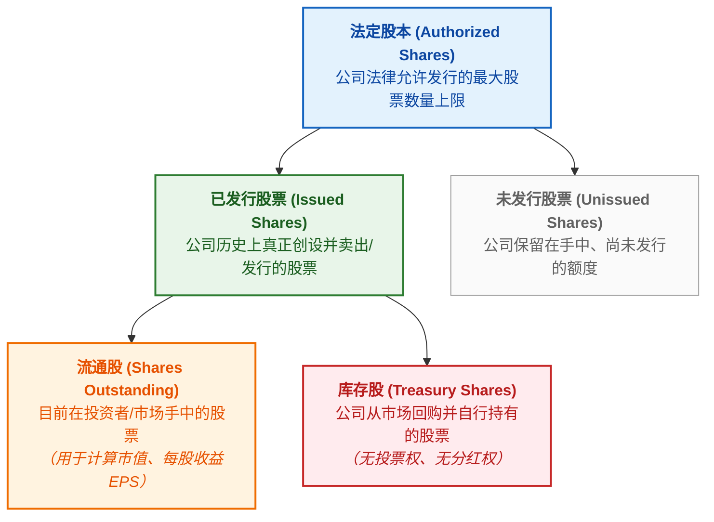
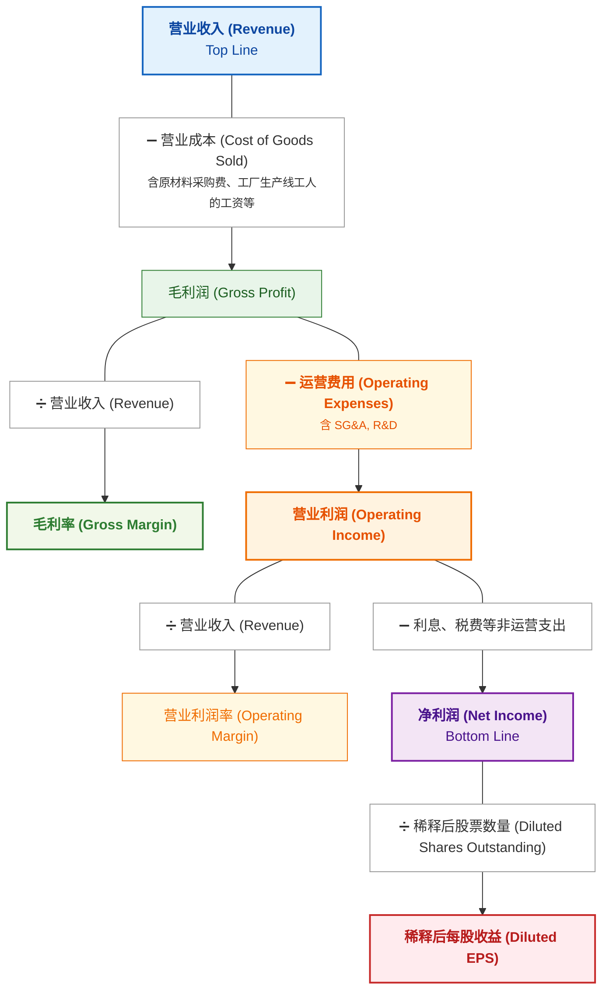

# Stock Trading Notes

## 1. 基础概念

### 持仓（Holdings / Position）
- **持仓：** 是指投资者**买入并持有**的资产（股票、基金、黄金、债券等）。
- **建仓（Open a Position）：** 第一次买入某只股票/基金（开始建立持仓）。
- **加仓 / 减仓（Add/Reduce to a Position）：** 增加买入 / 卖出手中一部分持仓。
- **平仓（Close a Position）：** 把持有的资产卖出或反向对冲，针对的是某一笔具体的交易。常见情形：看涨做多（Long）、看跌做空（Short）。
- **爆仓 / 强制平仓（Forced Liquidation / Margin Call）：** 当投资者加杠杆（借钱）炒股或做期货，亏损过大导致保证金不够时，交易平台或券商为了防止投资者欠钱不还，会不经你同意，强制把投资者的持仓卖掉。
- **清仓（Liquidate / Sell off）：** 把手里的某只股票/基金全部卖掉（持仓归零）。
- **重仓（Heavy Position）：** 把大部分资金都买在了某一只股票或某一个行业上。

加杠杆&期货

#### 加杠杆（Leverage）
加杠杆是指利用借入资金或衍生工具来放大投资规模的手段。
- **放大收益与风险：** 如果资产价格朝预期方向变动，盈利会按杠杆倍数成倍增加；反之，若价格向相反方向变动，亏损也会同等放大。
- **主要应用形式：**
    - 融资融券：向证券公司借钱买股（融资）或借股卖出（融券）。
    - 保证金交易：在期货、外汇等交易中，只需缴纳一定比例的保证金即可参与全额交易。

#### 期货 (Futures)
期货是一种标准化金融合约，约定在未来某个特定时间，以预先确定的价格买入或卖出特定数量的标的资产。
- **“期”与“现”相对：** 现货是“一手交钱，一手交货”；期货则是“现在签约，未来交割”。
- **标的物广泛：** 可涵盖大宗商品（如黄金、原油、农产品）或金融资产（如股票指数、国债）。
- **天然带有杠杆：** 期货交易采用保证金制度，通常只需缴纳合约价值约5%~15%的资金即可参与交易，因此期货本身就具有高杠杆属性。
- **主要目的：**
    - **套期保值（避险）：** 企业为防止未来原料价格上涨或产品价格下跌，预先在期货市场锁死价格。
    - **投机（获利）：** 交易者通过预测价格走势，利用价格波动赚取买卖差价。

### 流通股（Shares Outstanding）
流通股是目前在投资人和市场手里的总股数。

### 市值（Market Cap）
市值代表了一家上市公司在当前公开市场上“整体值多少钱”。
- Capitalization = 值（资本化、资本总额或价值）
- Market Cap = Stock Price × Shares Outstanding

### 股票指数（Stock Market Index / Index）
指数是指用来衡量整个市场或某个特定群体总体走势的“平均指标”。

#### 计算方式
指数由代表性资产组合而成，主要有三种加权计算规则：
- 市值加权（最常见）：公司市值越大，影响越大（如标普 500、沪深 300）。
- 价格加权：单股股价越高，影响越大（如道琼斯指数）。
- 等权重：所有成分公司占比完全相同。

#### 常见代表指数
- 美国：S&P 500（美国大盘晴雨表）、NASDAQ（科技与创新）、Dow Jones（传统工业巨头）。
- 中国：上证指数（沪市全貌）、沪深 300（A股大盘龙头）、创业板指（高成长/科技中小企业）。

####  三大核心作用
- **市场晴雨表：** 反映**整体经济或特定行业**的走势。
- **投资工具：** 投资者可通过购买跟踪指数的 ETF，实现一键配置相关市场。
- **业绩基准：** 作为衡量基金经理投资表现的参考标准。

#### 关键关注点
指数点数的**绝对值因基期不同而不可横向对比**，核心应看其**变动百分比（涨跌幅）**，这直接反映了该指数涵盖资产整体价值的增减幅度。

### ETF（Exchange-Traded Fund）
ETF 中文叫作交易型开放式指数基金（简称“交易所交易基金”）。简单来说，是可在交易所买卖的股票、债券、商品的“组合包”。
- **可在股市开盘时间内随时交易：** 价格实时变动，看准了价格就能立马挂单买入或卖出。
- **分散风险：** 一档 ETF 通常包含几十甚至上百只不同的标的（比如追踪某个指数的成份股）。例如，买入一份跟踪“标普 500 指数”的 ETF，就相当于一次性投资了美国 500 家头部大型上市公司，不会因为某一家公司倒闭而遭受毁灭性打击。
- **低费率：** ETF 多属于被动追踪指数，不需要基金经理花大量精力去主动选股，所以管理费和交易成本通常比普通基金更便宜。
- 常见类型
    - 股票型 ETF：跟踪股票指数（如：科技 ETF、医药 ETF、标普 500 ETF）。
    - 债券型 ETF：持有国债、企业债等，收益和风险相对稳健。
    - 商品型 ETF：跟踪黄金、原油等大宗商品价格（如：黄金 ETF）。

基金（Fund）

基金（Fund）就是把许多人的钱凑在一起，交给懂投资的专业专家去管理，用来买股票、债券、房地产等。赚到了钱，按比例分给各个投资者；亏了钱，投资者自己承担风险。

## 2. 利润表（Income Statement）

### 基础概念

### 例子：[NVIDIA Q2 Fiscal 2027 Summary](https://nvidianews.nvidia.com/news/nvidia-announces-financial-results-for-second-quarter-fiscal-2027)

**GAAP（Generally Accepted Accounting Principles）**

| $ in millions, except earnings per share |  Q2 FY27 |  Q1 FY27 |  Q2 FY26 |     Q/Q |     Y/Y |
| ---------------------------------------- | -------: | -------: | -------: | ------: | ------: |
| Revenue                                  | $96,221M | $81,615M | $46,743M |     18% |    106% |
| Gross margin                             |    75.0% |    74.9% |    72.4% | 0.1 pts | 2.6 pts |
| Operating expenses                       |  $8,408M |  $7,621M |  $5,413M |     10% |     55% |
| Operating income                         | $63,734M | $53,536M | $28,440M |     19% |    124% |
| Net income                               | $59,688M | $58,321M | $26,422M |      2% |    126% |
| Diluted earnings per share               |    $2.46 |    $2.39 |    $1.08 |      3% |    128% |

**Non-GAAP（Non-Generally Accepted Accounting Principles）**

| $ in millions, except earnings per share |  Q2 FY27 |  Q1 FY27 |  Q2 FY26 | Q/Q |     Y/Y |
| ---------------------------------------- | -------: | -------: | -------: | --: | ------: |
| Revenue                                  | $96,221M | $81,615M | $46,743M | 18% |    106% |
| Gross margin                             |    75.0% |    75.0% |    72.5% |   — | 2.5 pts |
| Operating expenses                       |  $8,232M |  $7,449M |  $5,361M | 11% |     54% |
| Operating income                         | $63,956M | $53,783M | $28,541M | 19% |    124% |
| Net income                               | $53,954M | $45,548M | $24,763M | 18% |    118% |
| Diluted earnings per share               |    $2.22 |    $1.87 |    $1.01 | 19% |    120% |

GAAP：按美国公认会计准则编制的财务数据；Non-GAAP：在 GAAP 基础上剔除公司认为不能代表正常经营表现的项目。两者通过 **reconciliation（调节表）** 连接，逐项说明从 GAAP 到 Non-GAAP 的调整及其金额。

---

**（1） GAAP vs. Non-GAAP：这张表发生了什么变化？**

| 指标                 |     GAAP | Non-GAAP |            变化 |
| ------------------ | -------: | -------: | ------------: |
| Revenue            | $96,221M | $96,221M |            不变 |
| Gross Margin       |    75.0% |    75.0% |            不变 |
| Operating Expenses |  $8,408M |  $8,232M |   **↓ $176M** |
| Operating Income   | $63,734M | $63,956M |   **↑ $222M** |
| Net Income         | $59,688M | $53,954M | **↓ $5,734M** |
| Diluted EPS        |    $2.46 |    $2.22 |   **↓ $0.24** |

* **Operating Expenses ↓ $176M**：Non-GAAP 剔除了一部分 GAAP 下计入运营费用的项目。
* **Operating Income ↑ $222M**：由于运营费用减少，营业利润相应增加。
* **Net Income ↓ $5,734M、Diluted EPS ↓ $0.24**：说明营业利润之后还有其他调整项目，其净影响反而减少了 Non-GAAP 的 Net Income 和 Diluted EPS。

> **注意：Non-GAAP 并不意味着数字一定比 GAAP 高。** 它的目的不是“美化数字”，而是剔除公司认为不能代表正常经营表现的项目；最终是变高还是变低，要看具体调整项目。

**（2） 为什么现在是 2026 年，却叫 FY27？**

**FY（Fiscal Year，财年）** 通常按公司规定的财年结束年份命名。NVIDIA 的财年截至每年 1 月最后一个星期日，因此 **FY27 是截至 2027 年 1 月结束的财年**，虽然其中大部分时间发生在 2026 年。

FY27 并不是“2026 + 1”的固定规则；不同公司可能采用不同的财年和命名方式，关键是看该公司的 Fiscal Year 定义。

**（3） Q/Q / Y/Y 是什么意思？**

* **Q/Q（Quarter-over-Quarter）**：与上一季度相比。
* **Y/Y（Year-over-Year）**：与去年同期相比。

**（4） 为什么 Non-GAAP Gross Margin 的 Q/Q 是 `--`？**

Q1 和 Q2 都是 **75.0%**，变化为 **0.0 percentage points**，因此没有需要报告的变化。

**（5） 为什么有 Revenue + Gross Margin，却没有 Gross Profit？**

**Gross Margin 是衡量 NVIDIA 产品经济性、定价权（Pricing Power）和竞争力的核心指标。**“定价权”即公司即使保持较高价格或面对成本上涨，仍有能力让客户接受而无需大幅降价。

毛利率没有统一的“好”标准，应与同行和自身历史水平比较；NVIDIA 的 **75% 已属于非常高的水平**。相比之下，Gross Profit 的绝对金额主要反映收入规模，在判断产品本身的盈利能力时不如 Gross Margin 直接，因此摘要表优先展示 Margin。

**（6） 为什么 Operating Income 没有 Operating Margin？**

Operating 层面的重点是**公司投入了多少，以及投入后赚了多少**：

* **Operating Expenses**：反映研发、销售等经营投入；
* **Operating Income**：反映扣除这些投入后留下的核心经营利润。

因此两者的绝对金额都有较强的分析价值，摘要表优先展示它们，而省略可自行计算的 Operating Margin。

**（7） 为什么 Gross Profit 不写 COGS，而 Operating Income 却写 Operating Expenses？**

两个层级关注的问题不同：**Gross 层面重点观察产品本身的盈利能力，因此突出 Gross Margin；Operating 层面则需要观察经营投入及其最终产出，因此同时列出 Operating Expenses 和 Operating Income。**

---

#### 分析与总结

这两张表最值得关注的不是单个数字，而是 **Revenue → Gross Margin → Operating Expenses → Operating Income → Net Income → EPS** 这一整条盈利链条。

**（1） NVIDIA 的核心业务规模仍在高速扩张**

Revenue 达到 **$96.2B**，Y/Y 增长 **106%**，意味着营收在一年内翻了一倍以上。更重要的是，Gross Margin 仍达到 **75.0%**，较去年同期 GAAP 的 72.4% 上升 **2.6 pts**。

这说明 NVIDIA 不仅卖得更多，而且在收入高速增长的同时仍维持极高的毛利率，体现出很强的**产品需求、定价权和竞争优势**。

**（2） 高毛利率让 NVIDIA 能够大规模投入研发，同时仍保持极高的经营利润**

Operating Expenses 为 **$8.4B**，Y/Y 增长 **55%**，明显低于 Revenue 的 **106%** 增速；与此同时，Operating Income 增长 **124%**。

这意味着 NVIDIA 的收入增长速度远高于运营费用增长速度，形成明显的**经营杠杆（Operating Leverage）**：规模扩大后，新增收入中的相当一部分能够转化为营业利润。

**（3） Net Income 和 EPS 的增长说明最终盈利能力仍然非常强**

GAAP Net Income Y/Y 增长 **126%**，Diluted EPS Y/Y 增长 **128%**，均超过 Revenue 的 106% 增速。

也就是说，NVIDIA 不只是“卖得更多”，而是**利润增长速度进一步超过营收增长速度**。

**（4） Q/Q 数据则显示增长仍在持续，但增速已经明显低于 Y/Y**

Revenue Q/Q 增长 **18%**，Operating Income Q/Q 增长 **19%**，说明公司仍在快速扩张；但与 Y/Y 的三位数增长相比，季度环比增速明显较低。

因此，这组数据同时体现了两件事：

**长期增长极强；短期增长依然强劲，但已经不是翻倍式增长。**

---

**总结：**

> NVIDIA 在 Q2 FY27 实现了营收翻倍、75% 的超高毛利率，以及利润增速超过营收增速，体现出强劲的需求、定价权和经营杠杆；同时，Q/Q 增速低于 Y/Y 增速，说明公司仍高速增长，但增长率正在从极端高位逐渐正常化。

## 3. 资产负债表（Balance Sheet）

### 例子：[NVIDIA 2027 Q2 10-Q — Balance Sheets](https://s201.q4cdn.com/141608511/files/doc_financials/2027/NVDA-2027-Q2-10Q-Final-including-exhibits.pdf?utm_source=chatgpt.com#page=5)

**NVIDIA Corporation and Subsidiaries Condensed Consolidated Balance Sheets (Unaudited)**

| $ in millions | Jul 26, 2026 | Jan 25, 2026 |
|---|---:|---:|
| **Assets** | | |
| **Current assets:** | | |
| Cash and cash equivalents | $22,443 | $10,605 |
| Marketable debt securities | $34,143 | $39,065 |
| Marketable equity securities | $42,783 | $12,886 |
| Accounts receivable, net | $63,059 | $38,466 |
| Inventories | $31,575 | $21,403 |
| Prepaid expenses and other current assets | $3,409 | $3,180 |
| **Total current assets** | **$197,412** | **$125,605** |
| Property and equipment, net | $14,285 | $10,383 |
| Operating lease assets | $5,390 | $2,867 |
| Goodwill | $21,125 | $20,832 |
| Intangible assets, net | $2,998 | $3,306 |
| Deferred income tax assets | $12,159 | $13,258 |
| Non-marketable securities | $51,157 | $22,251 |
| Other assets | $15,746 | $8,301 |
| **Total assets** | **$320,272** | **$206,803** |
| | | |
| **Liabilities and Shareholders’ Equity** | | |
| **Current liabilities:** | | |
| Accounts payable | $15,059 | $9,812 |
| Accrued and other current liabilities | $26,960 | $21,352 |
| Short-term debt | $1,000 | $999 |
| **Total current liabilities** | **$43,019** | **$32,163** |
| Long-term debt | $32,366 | $7,469 |
| Long-term operating lease liabilities | $4,985 | $2,572 |
| Other long-term liabilities | $10,918 | $7,306 |
| **Total liabilities** | **$91,288** | **$49,510** |
| Commitments and contingencies | | |
| | | |
| **Shareholders’ equity:** | | |
| Preferred stock | — | — |
| Common stock | $24 | $24 |
| Additional paid-in capital | $9,828 | $10,118 |
| Accumulated other comprehensive income (loss) | $(25) | $178 |
| Retained earnings | $219,157 | $146,973 |
| **Total shareholders’ equity** | **$228,984** | **$157,293** |
| **Total liabilities and shareholders’ equity** | **$320,272** | **$206,803** |

---

**（1）Condensed & Consolidated & Unaudited**

* **Condensed = 简明的 / 压缩版**

  10-Q 不需要像 10-K 一样完整展示所有年度财务报表细节，因此采用简明（Condensed）的财务报表形式。更多详细信息可以在财务报表附注（Notes）中找到。

* **Consolidated = 合并的**

  把母公司和需要合并的子公司（Subsidiaries）作为一个经济整体来展示。公司之间的内部交易（Intercompany Transactions）会被抵消（Eliminated）。

* **Unaudited = 未审计的**

  不意味着公司随便填的数字，也不意味着完全没有任何检查，而是没有进行 10-K 那种完整的独立审计（Audit）。会计师通常会进行 Review（审阅），但 Review 的保证程度低于 Audit。

**（2）Balance Sheet 的比较日期**

10-Q 的 Balance Sheet 通常列出：

* **本季度末（Current Quarter-end）**
* **上一财年末（Previous Fiscal Year-end）**

例如 NVIDIA Q2 FY27：

**July 26, 2026 vs. January 25, 2026**

二者都是公司在某个**时间点（Point in Time）**的财务状况，因此可以进行时点比较。

**（3）Assets（资产）**

公司拥有或控制、并预期能够带来未来经济利益的资源。

* **Marketable Debt Securities = 可交易的债务类证券 / 债券类投资**

  公司将暂时不用的资金投资于债券等债务证券，例如购买美国国债，从而获得利息（Interest）。

* **Marketable Equity Securities = 可交易的权益类证券 / 股票类投资**

  公司购买其他公司的股票，从而拥有该公司的部分股权，收益可能来自股价上涨以及股息（Dividends）。

* **Accounts Receivable = 应收账款**

  已经完成销售、已经有权收钱，但客户尚未付款的金额。

**（4）Liabilities（负债）**

公司欠别人、未来需要偿还或履行的义务。

* **Accounts Payable = 应付账款**

  公司已经收到商品或服务，但尚未付款，因此欠供应商的钱。

  例如：购买原材料，已经收到商品和发票，但尚未付款。

* **Accrued and Other Current Liabilities = 应计及其他流动负债**

  已经产生、但尚未支付或结算的短期义务。

  例如：已经发生但尚未支付的工资、税费和其他费用。

* **Short-term Debt = 短期债务**

  通常指一年以内到期的债务部分。

* **Long-term Debt = 长期债务**

  通常指超过一年以后到期的债务部分。

**（5） Shareholders' Equity（股东权益）**

把公司的资产全部变现、偿还所有负债后，理论上剩下属于股东的部分。

$$
\text{Shareholders' Equity} = \text{Assets} - \text{Liabilities}
$$

---

#### 分析与总结

**（1）资产规模大幅扩大**

Total Assets 从 **$206.8B 增加到 $320.3B**，六个月增加约 **$113.5B（+55%）**。其中 Total Current Assets 从 **$125.6B 增加到 $197.4B（+57%）**，说明这次资产扩张主要集中在流动资产。

**（2）证券投资明显增加**

Marketable Equity Securities 从 **$12.9B 增加到 $42.8B**，Non-marketable Securities 从 **$22.3B 增加到 $51.2B**。两项合计从约 **$35.1B 增加到 $93.9B**，说明 NVIDIA 持有的证券类投资在半年内明显增加。

**（3）Accounts Receivable 和 Inventory 都明显增加**

Accounts Receivable 从 **$38.5B 增加到 $63.1B（+64%）**，Inventories 从 **$21.4B 增加到 $31.6B（+47%）**。这意味着 NVIDIA 的资产中，有越来越多资金体现在客户尚未支付的应收账款和尚未出售的库存上，值得进一步关注这些资产后续的回收和消化情况。

**（4）负债规模明显增加，但负债占总资产的比例仍然较低**

Total Liabilities 从 **$49.5B 增加到 $91.3B（+84%）**，增长非常明显。其中 **Long-term Debt 从 $7.5B 增加到 $32.4B**，增加约 **$24.9B**，是负债增长最明显的项目，说明 NVIDIA 在这六个月中明显增加了长期债务。

不过，截至 July 26, 2026，Total Liabilities 约占 Total Assets 的 **28.5%**，仍明显低于 Shareholders' Equity 所占的 **71.5%**。因此，虽然负债规模增长很快，但相对于公司的整体资产规模，负债占比仍然较低。

**（5）短期偿债能力较强**

Total Current Assets 为 **$197.4B**，Total Current Liabilities 为 **$43.0B**，流动资产约为流动负债的 **4.6 倍**。从资产负债表本身来看，NVIDIA 持有的流动资产规模明显高于短期需要偿还的负债。

---

**总结：**

> 六个月内，NVIDIA 的资产规模大幅扩大，尤其是证券投资、应收账款和库存增长明显；负债规模也显著增加，主要体现在长期债务，但负债占总资产的比例仍然较低。同时，公司拥有远高于流动负债的流动资产。截至 July 26, 2026，NVIDIA 的资产负债结构整体仍较为稳健。

## 4. 现金流表（Cash Flow Statement）

### 例子：[NVIDIA 2027 Q2 10-Q — Statements of Cash Flows](https://s201.q4cdn.com/141608511/files/doc_financials/2027/NVDA-2027-Q2-10Q-Final-including-exhibits.pdf?utm_source=chatgpt.com#page=8)

**NVIDIA Corporation and Subsidiaries Condensed Consolidated Statements of Cash Flows (Unaudited)**

| $ in millions | Six Months Ended Jul 26, 2026 | Six Months Ended Jul 27, 2025 |
| --- | ---: | ---: |
| **Cash flows from operating activities:** | | |
| Net income | $118,010 | $45,197 |
| Stock-based compensation expense | $3,954 | $3,099 |
| Depreciation and amortization | $2,124 | $1,280 |
| Deferred income taxes | $982 | -$2,160 |
| Gains from equity securities, net | -$23,707 | -$2,073 |
| Other | $222 | -$196 |
| Accounts receivable | -$24,590 | -$4,743 |
| Inventories | -$10,204 | -$4,880 |
| Prepaid expenses and other assets | -$6,480 | $946 |
| Accounts payable | $4,125 | $2,255 |
| Accrued and other current liabilities | $8,015 | $3,075 |
| Other long-term liabilities | $1,970 | $979 |
| **Net cash provided by operating activities** | **$74,421** | **$42,779** |
| | | |
| **Cash flows from investing activities:** | | |
| Proceeds from sales and maturities of debt securities | $26,563 | $6,739 |
| Proceeds from sales of equity securities | $7,241 | $70 |
| Purchases of equity securities | -$42,404 | -$1,245 |
| Purchases of debt securities | -$21,777 | -$14,108 |
| Purchases related to property and equipment and intangible assets | -$4,434 | -$3,122 |
| Acquisitions, net of cash acquired | -$298 | -$677 |
| Other | -$15 | — |
| **Net cash used in investing activities** | **-$35,124** | **-$12,343** |
| | | |
| **Cash flows from financing activities:** | | |
| Proceeds related to issuance of debt, net of costs | $24,896 | — |
| Proceeds related to employee stock plans | $515 | $370 |
| Payments related to repurchases of common stock | -$39,044 | -$23,815 |
| Dividends paid | -$6,290 | -$488 |
| Payments related to employee stock plan taxes | -$4,531 | -$3,380 |
| Groq, Inc. | -$2,944 | — |
| Principal payments on property and equipment and intangible assets | -$92 | -$73 |
| Other | $31 | — |
| **Net cash used in financing activities** | **-$27,459** | **-$27,386** |
| | | |
| **Change in cash and cash equivalents** | **$11,838** | **$3,050** |
| Cash and cash equivalents at beginning of period | $10,605 | $8,589 |
| **Cash and cash equivalents at end of period** | **$22,443** | **$11,639** |

---

**（1） Operating Cash Flow（OCF，经营活动现金流）**

公司在正常经营活动中实际产生的现金流入减去经营活动产生的现金流出后，剩余的现金。

**（2） OCF-to-Net-Income Ratio**

$$
\text{OCF-to-Net-Income Ratio} = \frac{\text{Operating Cash Flow (OCF)}}{\text{Net Income}}
$$

用于比较公司的**会计利润**与**实际经营产生的现金**之间的关系。

**（3） Capital Expenditures（CapEx，资本性支出）**

公司为了维持或扩大经营能力，对 Property and Equipment（财产及设备）等长期资产进行的资本性投资。

**（4） Free Cash Flow（FCF，自由现金流）**

$$
\text{FCF} = \text{Operating Cash Flow (OCF)} - \text{Capital Expenditures (CapEx)}
$$

这是一个常用的简化计算方式，用于衡量公司经营产生的现金，在扣除资本性支出后还剩下多少可自由支配的现金。

**（5） Share Repurchases / Stock Buybacks（股票回购）**

* **何时回购 / 好处：** 当公司认为自己的股票价格合理或被低估，并且没有更好的资金用途时，可以回购股票。
  - **如果** Net Income（净利润）不变，则根据 $EPS = \frac{\text{Net Income}}{\text{Shares Outstanding}}$，流通股数减少会带来**更高的EPS**。
  - **如果** P/E（Price-to-Earnings Ratio，市盈率）不变，则根据 $股价 = EPS \times P/E$，EPS 上升会带来**更高的股价**。

* **何时不回购 / 坏处：** 如果公司明显高估时仍然大量回购，公司可能用远高于股票内在价值的现金买回股票，即**买入股票的实际价值低于公司支付的现金**，从而损害剩余股东的利益。此外，如果公司为了回购而大量借债，也可能增加财务风险。

---

#### 分析与总结

**（1）Operating Cash Flow（OCF）大幅增长，经营产生现金的能力明显增强**

NVIDIA 六个月的 OCF 从去年同期的 **$42.779B** 增加至 **$74.421B**，增加 **$31.642B**，同比增长约 **74%**。

这说明 NVIDIA 不仅 Net Income 大幅增长，而且主营业务实际产生的现金也同步大幅增加，公司的**现金创造能力明显增强**。

**（2）OCF-to-Net-Income Ratio 约为 63%，低于 100%，需要关注，但不能单独判断为坏事**

六个月 Net Income 为 **$118.010B**，OCF 为 **$74.421B**：

$$
\text{OCF-to-Net-Income Ratio} = \frac{74.421}{118.010} \approx 63\%
$$

去年同期：

$$
\frac{42.779}{45.197} \approx 95\%
$$

因此，这一比例从约 **95% 降至 63%**。

OCF 低于 Net Income，说明部分会计利润**尚未转化为同期现金**。从 Cash Flow Statement 来看，一个重要原因是 Accounts Receivable 和 Inventories 的增加：

* Accounts Receivable：现金流影响 **-$24.590B**
* Inventories：现金流影响 **-$10.204B**

也就是说，NVIDIA 有相当一部分收入已经计入 Net Income，但客户尚未付款，或者现金已经投入库存，因此暂时没有转化为现金。

**63% 本身不代表公司经营变差**，因为 NVIDIA 的 OCF 仍然同比增长约 74%，而且业务高速增长时，应收账款和库存往往会同步增加。

但与去年同期约 **95%** 相比明显下降，说明**利润转化为现金的效率有所下降**，因此值得继续观察后续季度 Accounts Receivable 和 Inventory 是否继续以较快速度增长。

**（3）FCF 非常高，意味着公司在完成资本性投资后仍产生大量可支配现金**

NVIDIA 六个月：

$$
FCF = 74.421-4.434 = \$69.987B
$$

去年同期：

$$
FCF = 42.779-3.122 = \$39.657B
$$

因此 FCF 从约 **$39.7B** 增加至 **$70.0B**，增加约 **$30.3B**，同比增长约 **76%**。

这意味着 NVIDIA 的主营业务在扣除资本性支出后，仍然能够留下非常大量的现金。

这些现金可以用于回购股票、支付股息、偿还债务、进行收购、购买证券或继续投资业务，而不需要完全依赖外部融资。

因此，高 FCF 通常意味着公司具有较强的**资金自主性和资本配置能力**。

**（4）Investing Activities 大幅净流出，但主要不是因为 CapEx**

NVIDIA 的 Net Cash Used in Investing Activities 从去年同期的 **-$12.343B** 增加至 **-$35.124B**。

但这不能简单理解为 NVIDIA 大幅增加了对经营资产的投资。

其中：

* Purchases of Equity Securities：**-$42.404B**
* Purchases of Debt Securities：**-$21.777B**
* Purchases related to Property and Equipment and Intangible Assets：**-$4.434B**

因此本期 Investing Activities 的大额现金流出主要来自**证券投资**，而不是 CapEx。

这说明 NVIDIA 在产生大量现金后，也将相当一部分现金用于金融资产配置。

**（5）NVIDIA 进行了非常大规模的股票回购，且回购金额明显高于去年同期**

Repurchases of Common Stock：

* 本期：**-$39.044B**
* 去年同期：**-$23.815B**

同比增加约 **$15.2B**，增幅约 **64%**。

结合 NVIDIA 在本期产生约 **$70.0B 的 FCF**，可以看出公司将相当大一部分现金用于股票回购。

从管理层的资本配置行为来看，大规模回购通常可以被理解为一个值得关注的**积极信号**：

**管理层愿意用大量公司现金购买自己的股票，至少说明管理层认为将资本用于回购具有足够的吸引力，而不是认为这些现金必须全部留在公司或投入其他项目。**

但它不是“管理层认为股价一定会上涨”的直接证据，因为公司回购也可能出于股权稀释管理、资本返还政策等其他原因。

**（6）公司同时发行了大量债务，需要结合回购一起观察**

NVIDIA 本期通过发行债务获得 **$24.896B**，而去年同期没有类似的大额债务发行。

与此同时，本期进行了 **$39.044B** 的股票回购。

因此，本期 NVIDIA 一方面产生了非常强的经营现金流，另一方面又主动增加债务融资并进行大规模资本配置。

这并不意味着公司缺钱——NVIDIA 本身拥有很强的现金创造能力——但说明公司正在积极利用**债务融资 + 经营现金流**进行资本配置。

由于 Total Liabilities 仍然相对于 Total Assets 较低，因此目前的债务规模整体仍处于较强的资产基础之上，但后续可以继续观察债务增加是否持续。

**（7）期末现金明显增加，整体现金流状况较强**

NVIDIA 本期 **Change in Cash and Cash Equivalents** 为 **+$11.838B**，去年同期为 **+$3.050B**。

也就是说，本期 NVIDIA 在进行了大规模证券投资、股票回购、股息支付以及其他资本配置之后，现金及现金等价物仍然实现了明显的净增加，而且净增加额较去年同期进一步扩大。

这说明 NVIDIA 当前的**经营现金流和 FCF 规模非常强，足以支撑大规模的资本配置，同时仍能增加现金储备**。

---

**总结：**

整体来看，NVIDIA 本期的 Cash Flow Statement 表现非常强：**Operating Cash Flow 和 FCF 大幅增长，虽然利润转化为现金的比例有所下降，但主要需要继续关注 Accounts Receivable 和 Inventories；同时公司进行了大规模证券投资、股票回购和股息支付，并主动增加债务融资，但期末现金仍明显增加。** 这说明 NVIDIA 当前具有非常强的现金创造能力和较大的资本配置空间。

TODO: income statement，balance sheet，cash flow，为何要3个一起看？单独看其中某个会出什么问题？同时看有什么新的视角？
