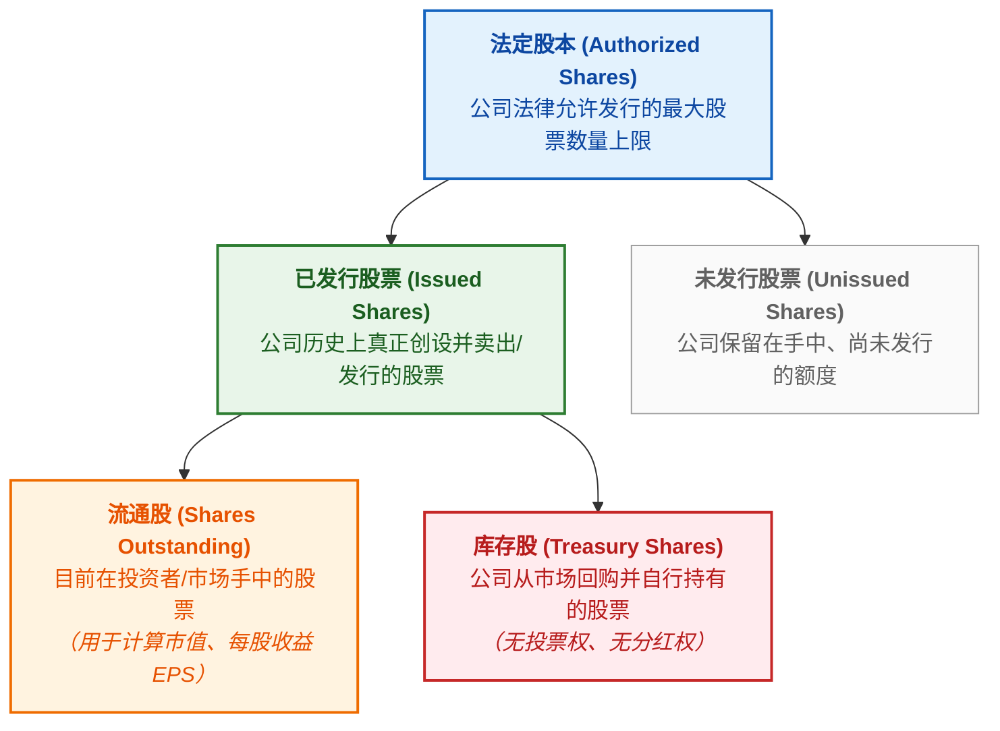
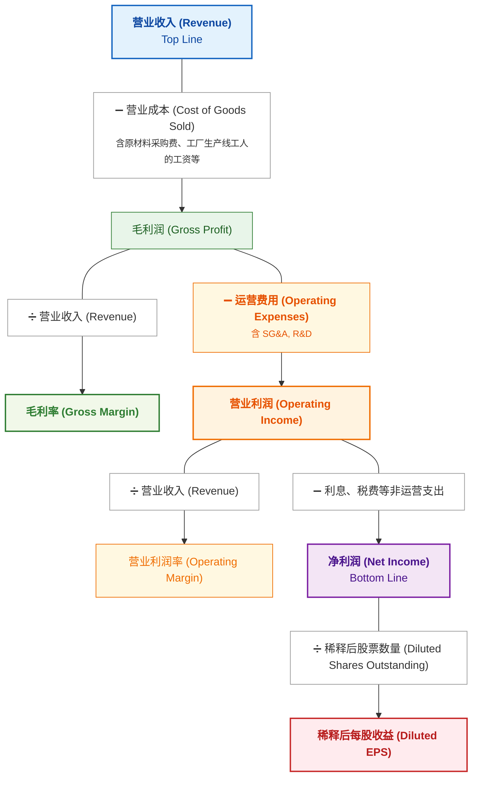

# Stock Trading Notes

## 1. 基础概念

### 持仓（Holdings / Position）
- **持仓：** 是指投资者**买入并持有**的资产（股票、基金、黄金、债券等）。
- **建仓（Open a Position）：** 第一次买入某只股票/基金（开始建立持仓）。
- **加仓 / 减仓（Add/Reduce to a Position）：** 增加买入 / 卖出手中一部分持仓。
- **平仓（Close a Position）：** 把持有的资产卖出或反向对冲，针对的是某一笔具体的交易。常见情形：看涨做多（Long）、看跌做空（Short）。
- **爆仓 / 强制平仓（Forced Liquidation / Margin Call）：** 当投资者加杠杆（借钱）炒股或做期货，亏损过大导致保证金不够时，交易平台或券商为了防止投资者欠钱不还，会不经你同意，强制把投资者的持仓卖掉。
- **清仓（Liquidate / Sell off）：** 把手里的某只股票/基金全部卖掉（持仓归零）。
- **重仓（Heavy Position）：** 把大部分资金都买在了某一只股票或某一个行业上。

加杠杆&期货

#### 加杠杆（Leverage）
加杠杆是指利用借入资金或衍生工具来放大投资规模的手段。
- **放大收益与风险：** 如果资产价格朝预期方向变动，盈利会按杠杆倍数成倍增加；反之，若价格向相反方向变动，亏损也会同等放大。
- **主要应用形式：**
    - 融资融券：向证券公司借钱买股（融资）或借股卖出（融券）。
    - 保证金交易：在期货、外汇等交易中，只需缴纳一定比例的保证金即可参与全额交易。

#### 期货 (Futures)
期货是一种标准化金融合约，约定在未来某个特定时间，以预先确定的价格买入或卖出特定数量的标的资产。
- **“期”与“现”相对：** 现货是“一手交钱，一手交货”；期货则是“现在签约，未来交割”。
- **标的物广泛：** 可涵盖大宗商品（如黄金、原油、农产品）或金融资产（如股票指数、国债）。
- **天然带有杠杆：** 期货交易采用保证金制度，通常只需缴纳合约价值约5%~15%的资金即可参与交易，因此期货本身就具有高杠杆属性。
- **主要目的：**
    - **套期保值（避险）：** 企业为防止未来原料价格上涨或产品价格下跌，预先在期货市场锁死价格。
    - **投机（获利）：** 交易者通过预测价格走势，利用价格波动赚取买卖差价。

### 流通股（Shares Outstanding）
流通股是目前在投资人和市场手里的总股数。

### 市值（Market Cap）
市值代表了一家上市公司在当前公开市场上“整体值多少钱”。
- Capitalization = 值（资本化、资本总额或价值）
- Market Cap = Stock Price × Shares Outstanding

### 股票指数（Stock Market Index / Index）
指数是指用来衡量整个市场或某个特定群体总体走势的“平均指标”。

#### 计算方式
指数由代表性资产组合而成，主要有三种加权计算规则：
- 市值加权（最常见）：公司市值越大，影响越大（如标普 500、沪深 300）。
- 价格加权：单股股价越高，影响越大（如道琼斯指数）。
- 等权重：所有成分公司占比完全相同。

#### 常见代表指数
- 美国：S&P 500（美国大盘晴雨表）、NASDAQ（科技与创新）、Dow Jones（传统工业巨头）。
- 中国：上证指数（沪市全貌）、沪深 300（A股大盘龙头）、创业板指（高成长/科技中小企业）。

####  三大核心作用
- **市场晴雨表：** 反映**整体经济或特定行业**的走势。
- **投资工具：** 投资者可通过购买跟踪指数的 ETF，实现一键配置相关市场。
- **业绩基准：** 作为衡量基金经理投资表现的参考标准。

#### 关键关注点
指数点数的**绝对值因基期不同而不可横向对比**，核心应看其**变动百分比（涨跌幅）**，这直接反映了该指数涵盖资产整体价值的增减幅度。

### ETF（Exchange-Traded Fund）
ETF 中文叫作交易型开放式指数基金（简称“交易所交易基金”）。简单来说，是可在交易所买卖的股票、债券、商品的“组合包”。
- **可在股市开盘时间内随时交易：** 价格实时变动，看准了价格就能立马挂单买入或卖出。
- **分散风险：** 一档 ETF 通常包含几十甚至上百只不同的标的（比如追踪某个指数的成份股）。例如，买入一份跟踪“标普 500 指数”的 ETF，就相当于一次性投资了美国 500 家头部大型上市公司，不会因为某一家公司倒闭而遭受毁灭性打击。
- **低费率：** ETF 多属于被动追踪指数，不需要基金经理花大量精力去主动选股，所以管理费和交易成本通常比普通基金更便宜。
- 常见类型
    - 股票型 ETF：跟踪股票指数（如：科技 ETF、医药 ETF、标普 500 ETF）。
    - 债券型 ETF：持有国债、企业债等，收益和风险相对稳健。
    - 商品型 ETF：跟踪黄金、原油等大宗商品价格（如：黄金 ETF）。

基金（Fund）

基金（Fund）就是把许多人的钱凑在一起，交给懂投资的专业专家去管理，用来买股票、债券、房地产等。赚到了钱，按比例分给各个投资者；亏了钱，投资者自己承担风险。

## 2. 公司利润

### 基础概念

### 例子：[NVIDIA Q2 Fiscal 2027 Summary](https://nvidianews.nvidia.com/news/nvidia-announces-financial-results-for-second-quarter-fiscal-2027)

**GAAP（Generally Accepted Accounting Principles）**

| $ in millions, except earnings per share |  Q2 FY27 |  Q1 FY27 |  Q2 FY26 |     Q/Q |     Y/Y |
| ---------------------------------------- | -------: | -------: | -------: | ------: | ------: |
| Revenue                                  | $96,221M | $81,615M | $46,743M |     18% |    106% |
| Gross margin                             |    75.0% |    74.9% |    72.4% | 0.1 pts | 2.6 pts |
| Operating expenses                       |  $8,408M |  $7,621M |  $5,413M |     10% |     55% |
| Operating income                         | $63,734M | $53,536M | $28,440M |     19% |    124% |
| Net income                               | $59,688M | $58,321M | $26,422M |      2% |    126% |
| Diluted earnings per share               |    $2.46 |    $2.39 |    $1.08 |      3% |    128% |

**Non-GAAP（Non-Generally Accepted Accounting Principles）**

| $ in millions, except earnings per share |  Q2 FY27 |  Q1 FY27 |  Q2 FY26 | Q/Q |     Y/Y |
| ---------------------------------------- | -------: | -------: | -------: | --: | ------: |
| Revenue                                  | $96,221M | $81,615M | $46,743M | 18% |    106% |
| Gross margin                             |    75.0% |    75.0% |    72.5% |   — | 2.5 pts |
| Operating expenses                       |  $8,232M |  $7,449M |  $5,361M | 11% |     54% |
| Operating income                         | $63,956M | $53,783M | $28,541M | 19% |    124% |
| Net income                               | $53,954M | $45,548M | $24,763M | 18% |    118% |
| Diluted earnings per share               |    $2.22 |    $1.87 |    $1.01 | 19% |    120% |

GAAP：按美国公认会计准则编制的财务数据；Non-GAAP：在 GAAP 基础上剔除公司认为不能代表正常经营表现的项目。两者通过 **reconciliation（调节表）** 连接，逐项说明从 GAAP 到 Non-GAAP 的调整及其金额。

**（1） GAAP vs. Non-GAAP：这张表发生了什么变化？**

| 指标                 |     GAAP | Non-GAAP |            变化 |
| ------------------ | -------: | -------: | ------------: |
| Revenue            | $96,221M | $96,221M |            不变 |
| Gross Margin       |    75.0% |    75.0% |            不变 |
| Operating Expenses |  $8,408M |  $8,232M |   **↓ $176M** |
| Operating Income   | $63,734M | $63,956M |   **↑ $222M** |
| Net Income         | $59,688M | $53,954M | **↓ $5,734M** |
| Diluted EPS        |    $2.46 |    $2.22 |   **↓ $0.24** |

* **Operating Expenses ↓ $176M**：Non-GAAP 剔除了一部分 GAAP 下计入运营费用的项目。
* **Operating Income ↑ $222M**：由于运营费用减少，营业利润相应增加。
* **Net Income ↓ $5,734M、Diluted EPS ↓ $0.24**：说明营业利润之后还有其他调整项目，其净影响反而减少了 Non-GAAP 的 Net Income 和 Diluted EPS。

> **注意：Non-GAAP 并不意味着数字一定比 GAAP 高。** 它的目的不是“美化数字”，而是剔除公司认为不能代表正常经营表现的项目；最终是变高还是变低，要看具体调整项目。

**（2） 为什么现在是 2026 年，却叫 FY27？**

**FY（Fiscal Year，财年）** 通常按公司规定的财年结束年份命名。NVIDIA 的财年截至每年 1 月最后一个星期日，因此 **FY27 是截至 2027 年 1 月结束的财年**，虽然其中大部分时间发生在 2026 年。

FY27 并不是“2026 + 1”的固定规则；不同公司可能采用不同的财年和命名方式，关键是看该公司的 Fiscal Year 定义。

**（3） Q/Q / Y/Y 是什么意思？**

* **Q/Q（Quarter-over-Quarter）**：与上一季度相比。
* **Y/Y（Year-over-Year）**：与去年同期相比。

**（4） 为什么 Non-GAAP Gross Margin 的 Q/Q 是 `--`？**

Q1 和 Q2 都是 **75.0%**，变化为 **0.0 percentage points**，因此没有需要报告的变化。

**（5） 为什么有 Revenue + Gross Margin，却没有 Gross Profit？**

**Gross Margin 是衡量 NVIDIA 产品经济性、定价权（Pricing Power）和竞争力的核心指标。**“定价权”即公司即使保持较高价格或面对成本上涨，仍有能力让客户接受而无需大幅降价。

毛利率没有统一的“好”标准，应与同行和自身历史水平比较；NVIDIA 的 **75% 已属于非常高的水平**。相比之下，Gross Profit 的绝对金额主要反映收入规模，在判断产品本身的盈利能力时不如 Gross Margin 直接，因此摘要表优先展示 Margin。

**（6） 为什么 Operating Income 没有 Operating Margin？**

Operating 层面的重点是**公司投入了多少，以及投入后赚了多少**：

* **Operating Expenses**：反映研发、销售等经营投入；
* **Operating Income**：反映扣除这些投入后留下的核心经营利润。

因此两者的绝对金额都有较强的分析价值，摘要表优先展示它们，而省略可自行计算的 Operating Margin。

**（7） 为什么 Gross Profit 不写 COGS，而 Operating Income 却写 Operating Expenses？**

两个层级关注的问题不同：**Gross 层面重点观察产品本身的盈利能力，因此突出 Gross Margin；Operating 层面则需要观察经营投入及其最终产出，因此同时列出 Operating Expenses 和 Operating Income。**

---

#### 分析与总结

这两张表最值得关注的不是单个数字，而是 **Revenue → Gross Margin → Operating Expenses → Operating Income → Net Income → EPS** 这一整条盈利链条。

**（1） NVIDIA 的核心业务规模仍在高速扩张**

Revenue 达到 **$96.2B**，Y/Y 增长 **106%**，意味着营收在一年内翻了一倍以上。更重要的是，Gross Margin 仍达到 **75.0%**，较去年同期 GAAP 的 72.4% 上升 **2.6 pts**。

这说明 NVIDIA 不仅卖得更多，而且在收入高速增长的同时仍维持极高的毛利率，体现出很强的**产品需求、定价权和竞争优势**。

**（2） 高毛利率让 NVIDIA 能够大规模投入研发，同时仍保持极高的经营利润**

Operating Expenses 为 **$8.4B**，Y/Y 增长 **55%**，明显低于 Revenue 的 **106%** 增速；与此同时，Operating Income 增长 **124%**。

这意味着 NVIDIA 的收入增长速度远高于运营费用增长速度，形成明显的**经营杠杆（Operating Leverage）**：规模扩大后，新增收入中的相当一部分能够转化为营业利润。

**（3） Net Income 和 EPS 的增长说明最终盈利能力仍然非常强**

GAAP Net Income Y/Y 增长 **126%**，Diluted EPS Y/Y 增长 **128%**，均超过 Revenue 的 106% 增速。

也就是说，NVIDIA 不只是“卖得更多”，而是**利润增长速度进一步超过营收增长速度**。

**（4） Q/Q 数据则显示增长仍在持续，但增速已经明显低于 Y/Y**

Revenue Q/Q 增长 **18%**，Operating Income Q/Q 增长 **19%**，说明公司仍在快速扩张；但与 Y/Y 的三位数增长相比，季度环比增速明显较低。

因此，这组数据同时体现了两件事：

> **长期增长极强；短期增长依然强劲，但已经不是翻倍式增长。**

**一句话总结：**

> NVIDIA 在 Q2 FY27 实现了营收翻倍、75% 的超高毛利率，以及利润增速超过营收增速，体现出强劲的需求、定价权和经营杠杆；同时，Q/Q 增速低于 Y/Y 增速，说明公司仍高速增长，但增长率正在从极端高位逐渐正常化。
